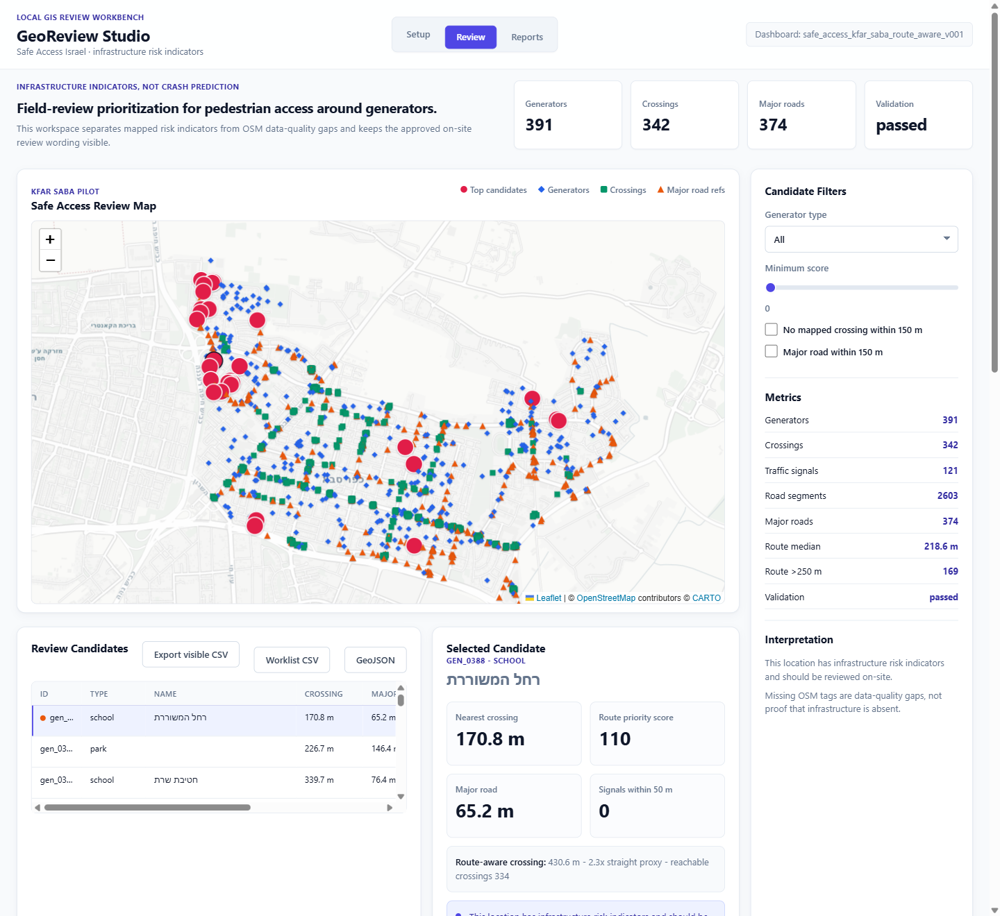

# GeoReview Studio v083

GeoReview Studio scans OpenStreetMap / Geofabrik data for a pilot area (Kfar Saba) and surfaces the pedestrian destinations — schools, kindergartens, parks, bus stops — that sit far from a mapped crossing, so a municipal or road-safety reviewer can **prioritise which locations to inspect on-site first**. It is a local-first, field-review prioritisation tool that flags locations for human review; it makes no crash-prediction or absolute-safety claims.

As a portfolio project, it demonstrates GIS data engineering, road-safety domain modelling, and pragmatic software engineering.

## Screenshots



<sub>Dashboard-first review workspace (desktop, 1440×1320).</sub>

## Data highlights

One local pipeline turns raw OpenStreetMap / Geofabrik extracts into a ranked, explainable review shortlist for a pilot city (Kfar Saba). Every figure below is the committed pilot run.

| Layer built from OSM (analysis CRS EPSG:2039) | Count |
|---|---:|
| Pedestrian destinations — schools, kindergartens, parks, playgrounds, bus stops | **391** |
| Mapped pedestrian crossings | **342** |
| Road segments | **2 603** |
| Major roads | 374 |
| Mapped traffic-calming features | 11 |

- **How each destination is measured** — distance to the nearest **mapped pedestrian crossing**, computed two ways: straight-line **and** along an OSM road-network proxy graph (9 828 nodes / 11 366 edges), plus a route-vs-straight **detour ratio**. It is a *mapped* crossing, not a "signalised" one: only 155 of the 342 crossings (45 %) carry a `traffic_signals` tag — the rest are marked, uncontrolled or generic.
- **What the pilot found** — median route distance to the nearest mapped crossing is **218.6 m** (p90 627.2 m); **169 of 391** destinations (43 %) are over **250 m** away by route, and 244 are over 150 m. Median detour ratio is 1.26 (p90 1.67); 13 destinations combine a long route with a high detour.
- **Transparent, auditable scoring** — every point traces to one rule in [`config/scoring_rules_v001.json`](config/scoring_rules_v001.json) (major road within 150 m = 25, no mapped crossing within 150 m = 25, route over 250 m = 20, …). Scores range 25–110; every destination scored ≥ 25, so all 391 are candidates and the queue ranks *degree* of concern worst-first rather than splitting "flagged vs clean".
- **Data-quality kept separate from risk** — a missing OSM tag (no sidewalk / lighting / signal tag) lands in a `data_quality_flags` column and adds **zero** points; it is never counted as evidence of risk. Network-unreachability is treated the same way, since the proxy graph may be incomplete.
- **Engineering** — stdlib-only Python + vanilla JS, zero runtime dependencies; reviewer decisions (status / note / assignee) persist in a local **SQLite** store; the shortlist exports as a **CSV or GeoJSON** field worklist (Excel- and QGIS-ready).
- **Limits, up front** — the score is transparent but **uncalibrated** and never checked against crash or outcome data (see the honesty box below); the road-network distance is an OSM proxy, not verified pedestrian routing; the thresholds and EPSG:2039 projection are Israel/OSM-shaped; the pilot boundary is OSM/Geofabrik, not an official municipal boundary.

Full method, a findings table and the ranked top 20 are in [`portfolio/case_study.md`](portfolio/case_study.md).

## Who it's for

Municipal road-safety planners, pedestrian-access reviewers and GIS analysts who need to turn raw OSM data into a ranked, evidence-backed shortlist of locations worth a physical visit.

## What to look at

- **The product**: the dashboard (map + review queue + selected-candidate evidence), the Kfar Saba pilot results in [`portfolio/case_study.md`](portfolio/case_study.md), and the transparent, audited scoring in [`config/scoring_rules_v001.json`](config/scoring_rules_v001.json) + [`docs/scoring_rules.md`](docs/scoring_rules.md).
- **The GIS workflow**: source onboarding → selected-pilot preflight → run analysis profile → dashboard candidates → **review-worklist export (CSV / GeoJSON)** → portfolio report.
- **Editorial note**: an earlier AI-assisted build had accreted ~50 self-referential "tooling" endpoints (publication / QA / release-readiness machinery that mostly packaged the project itself). I removed them to keep the product core honest and reviewable — the backend is now ~32 focused modules. The full pre-subtraction tree is preserved on the `archive/full-app-2026-06-25` branch.

## How to read the score (and what it is not)

The score is a **transparent but UNCALIBRATED** heuristic: it measures where mapped pedestrian-crossing access is *sparse* near a destination — it is **never checked against real crash or outcome data**. So it tells you **where to look first, not where it is worst**. It is a triage aid for on-site review, not a verdict.

- NOT crash / accident prediction. NOT a calibrated severity ranking.
- A missing OSM tag is a **data-quality flag**, never proof that infrastructure is absent.
- Analysis CRS is EPSG:2039 (Israeli grid): the pipeline generalises to other regions by reprojection, but the distance thresholds stay Israel/OSM-shaped until recalibrated.

Approved wording:

`This location has infrastructure risk indicators and should be reviewed on-site.`

## Current Release

App version `v083` · manifest `v083_2026-06-01` · local URL `http://127.0.0.1:8847`

## Run Locally

```powershell
git clone https://github.com/evgeniuka/georeview-studio.git
cd georeview-studio
python -B backend\app.py
```

Open `http://127.0.0.1:8847`. Stdlib-only Python — nothing to install, no build step.

A **bundled demo store** (~2 MB, the Kfar Saba pilot subset) ships in [`demo_data/`](demo_data/), so a fresh clone launches straight into the working product: the ranked review worklist, the Leaflet street map, and CSV / GeoJSON worklist export. The server starts in **product mode** by default (only the GIS-review endpoints — see [`docs/product_mode.md`](docs/product_mode.md)).

To run against a different or fuller analysis store, point the app at a directory that contains an `analysis_output/` folder:

```powershell
$env:GEOREVIEW_DATA_ROOT = "C:\path\to\store"   # expects <store>\analysis_output\...
python -B backend\app.py
```

> **Demo data & attribution.** The bundled tables are derived from OpenStreetMap / Geofabrik data, © OpenStreetMap contributors, licensed under the [Open Database License (ODbL)](https://opendatacommons.org/licenses/odbl/). They are a trimmed pilot extract for demonstration — not an authoritative dataset. The full multi-GB analysis store is intentionally not committed.

## Repository map

- Project rules: `AGENTS.md`
- Release manifest: `project_manifest.json`
- Backend entrypoint: `backend/app.py`
- Frontend assets: `frontend/static`
- Validation: `tests/validate_app.py`
- API contract tests: `tests/test_api_contract.py`
- Product and release docs: `docs/`

The `AGENTS.md` working rules and the editorial note above — recording the deliberate removal of ~50 self-referential tooling endpoints — are kept in the repository as visible evidence that this AI-assisted build was scoped and pruned under human control rather than left to accrete.
