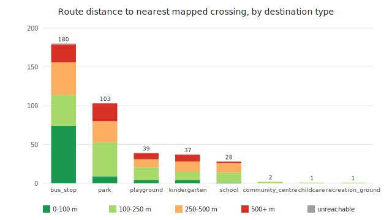
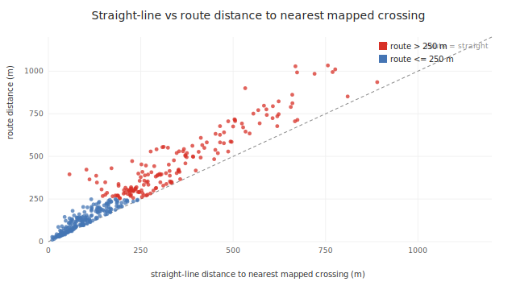
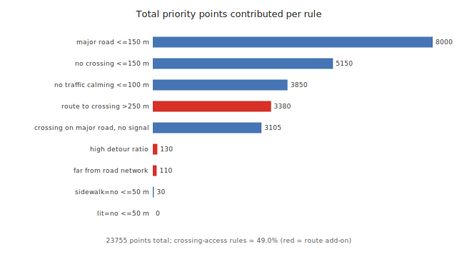
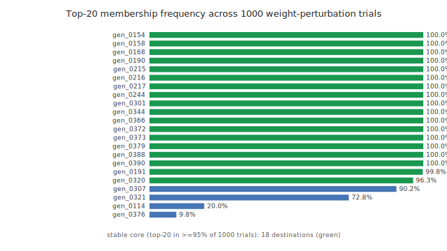

# Kfar Saba crossing-access — analysis report

Recomputed from the committed pilot workspace (`safe_access_kfar_saba_route_aware_v001`) by a single standard-library Python script, `scripts/generate_analysis_report.py`. Every figure is generated, not hand-drawn. Wording follows the policy in [`../scope.md`](../scope.md).

## S0 — Executive summary

**Headline numbers**

- 391 pedestrian destinations measured against 342 mapped pedestrian crossings, over 2603 road segments.
- 155 of 342 crossings (45.3 %) carry a `traffic_signals` tag; the rest are marked, uncontrolled or generic.
- Priority scores span 25–110; every destination carries at least one indicator, so the ranking separates degree of concern, not presence.
- The top-20 shortlist is stable under +/-50 % weight perturbation (median top-20 Jaccard 1.0; 18 of 20 recur in >=95 % of 1,000 trials). **A stable ranking can still be a wrong ranking; stability is not validation.**

**Claim boundaries**

- The median route distance to the nearest mapped crossing is **218.6 m** (a direct recompute from the committed tables, which round distances to 0.1 m, gives 218.7 m).
- **169 of 391 destinations** are beyond 250 m from the nearest mapped crossing by route.
- The priority score is transparent but **UNCALIBRATED** — it is never checked against real outcome data, so it says where to look first, not where conditions are worst. The approved and restricted wording is defined in [`../scope.md`](../scope.md).

> This location has infrastructure risk indicators and should be reviewed on-site.

## S1 — Study area and data inventory

| Layer | Count |
|---|---:|
| Pedestrian destinations | 391 |
| Mapped pedestrian crossings | 342 |
| Road segments | 2603 |
| Road-network graph nodes | 9828 |
| Road-network graph edges | 11366 |
| Road segments included in the network proxy | 2514 |
| Road segments excluded (motorway/trunk/track/unknown) | 89 |

**Crossing type mix** — distance is measured to the nearest *mapped* crossing, not a signal-controlled one:

| Crossing type | Count |
|---|---:|
| `traffic_signals` | 155 |
| `uncontrolled` | 123 |
| `marked` | 35 |
| `pedestrian_crossing` | 29 |

**Destination type mix:**

| Destination type | Count |
|---|---:|
| `bus_stop` | 180 |
| `park` | 103 |
| `playground` | 39 |
| `kindergarten` | 37 |
| `school` | 28 |
| `community_centre` | 2 |
| `childcare` | 1 |
| `recreation_ground` | 1 |

*Reconciliation:* all counts above are computed in SQL from the committed workspace tables and match the workspace `network_analysis_summary.json` exactly. The distance percentiles in S2 are quoted from that summary (full precision) and reproduce from the tables within 0.1 m, since the tables round distances to 0.1 m.

## S2 — Distance to the nearest mapped crossing

Each destination is measured to the nearest mapped crossing two ways: straight-line and along the OSM road-network proxy graph. The median route distance is **218.6 m** (p90 627.2 m); **169 of 391** destinations (43 %) are beyond 250 m by route and 244 are beyond 150 m. 390 destinations reach a crossing across the proxy graph; 1 does not (gen_0152) and is reported as a data-quality gap, not a finding. The median route-to-straight detour ratio is 1.26.

*Figure 1. Route distance to the nearest mapped crossing, banded and stacked per destination type. Bands are upper-inclusive, so the two longest bands together equal the 250 m count above.*

*Figure 2. Straight-line versus route distance for every reachable destination; the dashed line is route = straight. Points above it (the majority) travel further along the network than the crow-flies distance implies.*

### Reproducing the ranking

The live dashboard candidates endpoint orders destinations by `(-route_review_priority_score, -risk_score, -nearest_crossing_m)`. That key leaves ties unresolved, and the app falls back on Python's stable sort, which is not reproducible from the tables alone. This report appends `generator_id` ascending as a final deterministic tie-break; the top five under that order are:

| # | Type | Name | Straight (m) | Route (m) | Score |
|--:|---|---|--:|--:|--:|
| 1 | school | רחל המשוררת | 170.8 | 430.6 | 110 |
| 2 | park | — | 226.7 | 472.5 | 105 |
| 3 | school | חטיבת שרת | 339.7 | 477.0 | 100 |
| 4 | school | חטיבת שז"ר | 270.6 | 334.0 | 100 |
| 5 | school | חטיבת הביניים ע"ש יורם טהרלב | 254.5 | 409.2 | 100 |

## S3 — Anatomy of the score

Every priority score is a sum over a small fixed rule set. Recomputing each score from its fired flags times the configured weights **reconciles with** the stored `route_review_priority_score` for all 391 rows (391 of 391, 0 mismatches).

| Rule | Group | Weight | Fires | Points | Share |
|---|---|--:|--:|--:|--:|
| `major_road_within_150m` | common | 25 | 320 | 8000 | 33.7 % |
| `no_mapped_crossing_within_150m` | common | 25 | 206 | 5150 | 21.7 % |
| `no_mapped_traffic_calming_within_100m_weak_indicator` | common | 10 | 385 | 3850 | 16.2 % |
| `route_nearest_crossing_over_250m` | route | 20 | 169 | 3380 | 14.2 % |
| `nearest_crossing_near_major_road_without_signal_within_50m` | common | 15 | 207 | 3105 | 13.1 % |
| `high_network_detour_ratio` | route | 10 | 13 | 130 | 0.5 % |
| `generator_far_from_network_proxy` | route | 5 | 22 | 110 | 0.5 % |
| `explicit_sidewalk_no_within_50m` | common | 10 | 3 | 30 | 0.1 % |
| `explicit_lit_no_within_50m` | common | 5 | 0 | 0 | 0.0 % |
| **total** | | | | **23755** | 100 % |

The crossing-access rules (sparse or inadequate mapped crossings — `no_mapped_crossing_within_150m`, `nearest_crossing_near_major_road_without_signal_within_50m`, `route_nearest_crossing_over_250m`) supply **49.0 %** of all points, the largest single group.

**Dead rules.** `explicit_lit_no_within_50m` fires 0 times and `explicit_sidewalk_no_within_50m` fires 3 times — not because the area is well served, but because those OSM tags are sparsely mapped: a lit tag of any value sits near only 10.0 % of destinations and a sidewalk tag near 5.1 %, and the explicit `lit=no` / `sidewalk=no` values these rules require are rarer still (0 and 3 of 391 destinations). A missing tag stays a data-quality gap and adds no points, so these two rules cannot move this ranking.

Scores take only 17 distinct values (range 25–110); those heavy ties drive the rank handling in S4.

*Figure 3. Total priority points per rule (fire count x weight); route add-ons in red. The two dead rules contribute almost nothing.*

## S4 — How robust is the ranking?

Three protocols ask whether the shortlist survives reasonable changes to the scoring. Each re-ranks all 391 destinations with the app tie-break plus `generator_id` as a final deterministic key. **A stable ranking can still be a wrong ranking; stability is not validation.**

**Protocol A — weight perturbation.** 1,000 trials; each multiplies every one of the 9 weights by an independent `uniform(0.5, 1.5)` factor, then re-ranks:

- Top-20 Jaccard vs baseline: median **1.0** (p5 0.818, p95 1.0).
- Top-50 Jaccard: median 1.0 (p5 0.923, p95 1.0).
- Tie-aware Spearman rho vs baseline: median 0.98 (p5 0.925, p95 0.998).
- **Stable core** (top-20 in >=95 % of trials): 18 of 20 destinations.

*Figure 4. How often each destination lands in the top 20 across the 1,000 trials; green bars are the stable core (>=95 %).*

> Tie-aware Spearman uses average ranks for tied scores with Pearson on those ranks. The textbook `1 - 6*sum(d^2)/(n*(n^2-1))` shortcut is invalid here because scores take only 17 distinct values, so ties are pervasive.

**Protocol B — leave one rule out.** Drop each rule in turn (9 deterministic runs) and re-rank:

| Rule dropped | Top-20 Jaccard | Spearman rho |
|---|--:|--:|
| `generator_far_from_network_proxy` | 0.667 | 0.997 |
| `nearest_crossing_near_major_road_without_signal_within_50m` | 0.667 | 0.93 |
| `no_mapped_crossing_within_150m` | 0.739 | 0.806 |
| `route_nearest_crossing_over_250m` | 0.739 | 0.909 |
| `high_network_detour_ratio` | 0.905 | 0.995 |
| `explicit_lit_no_within_50m` | 1.0 | 1.0 |
| `explicit_sidewalk_no_within_50m` | 1.0 | 0.999 |
| `major_road_within_150m` | 1.0 | 0.902 |
| `no_mapped_traffic_calming_within_100m_weak_indicator` | 1.0 | 0.999 |

The most disruptive single drops take the top-20 Jaccard down to 0.667 (`generator_far_from_network_proxy` and `nearest_crossing_near_major_road_without_signal_within_50m`); dropping either dead rule leaves the top 20 unchanged.

**Protocol D — straight-only vs route-aware.** Ranking by `base_risk_score` (straight-line only) against the route-aware `route_review_priority_score`:

- Tie-aware Spearman rho 0.899, Kendall tau-b 0.811, top-20 Jaccard 0.538.
- Route-awareness brings 6 destinations into the top 20 and drops 6.

| Generator | Type | Straight rank | Route rank | Move | Detour ratio |
|---|---|--:|--:|--:|--:|
| `gen_0389` | school | 210 | 57 | +153 | 4.1 |
| `gen_0376` | school | 194 | 56 | +138 | 2.64 |
| `gen_0294` | park | 245 | 108 | +137 | 6.92 |
| `gen_0120` | bus_stop | 307 | 208 | +99 | 1.2 |
| `gen_0232` | park | 391 | 299 | +92 | 2.99 |

Kendall tau-b is computed once here, never inside the 1,000-trial loop where its O(n^2) cost would dominate.

