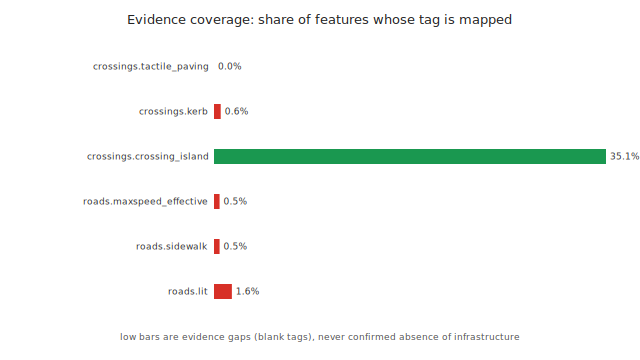

# Kfar Saba crossing-access — analysis report

Recomputed from the committed pilot workspace (`safe_access_kfar_saba_route_aware_v001`) by a single standard-library Python script, `scripts/generate_analysis_report.py`. Every figure is generated, not hand-drawn. Wording follows the policy in [`../scope.md`](../scope.md).

## S0 — Executive summary

**Headline numbers**

- 391 pedestrian destinations measured against 342 mapped pedestrian crossings, over 2603 road segments.
- 155 of 342 crossings (45.3 %) carry a `traffic_signals` tag; the rest are marked, uncontrolled or generic.
- Priority scores span 25–110; every destination carries at least one indicator, so the ranking separates degree of concern, not presence.
- The top-20 shortlist is stable under +/-50 % weight perturbation (median top-20 Jaccard 1.0; 18 of 20 recur in >=95 % of 1,000 trials). **A stable ranking can still be a wrong ranking; stability is not validation.**

**Claim boundaries**

- The median route distance to the nearest mapped crossing is **218.6 m** (a direct recompute from the committed tables, which round distances to 0.1 m, gives 218.7 m).
- **169 of 391 destinations** are beyond 250 m from the nearest mapped crossing by route.
- The priority score is transparent but **UNCALIBRATED** — it is never checked against real outcome data, so it says where to look first, not where conditions are worst. The approved and restricted wording is defined in [`../scope.md`](../scope.md).

> This location has infrastructure risk indicators and should be reviewed on-site.

## S1 — Study area and data inventory

| Layer | Count |
|---|---:|
| Pedestrian destinations | 391 |
| Mapped pedestrian crossings | 342 |
| Road segments | 2603 |
| Road-network graph nodes | 9828 |
| Road-network graph edges | 11366 |
| Road segments included in the network proxy | 2514 |
| Road segments excluded (motorway/trunk/track/unknown) | 89 |

**Crossing type mix** — distance is measured to the nearest *mapped* crossing, not a signal-controlled one:

| Crossing type | Count |
|---|---:|
| `traffic_signals` | 155 |
| `uncontrolled` | 123 |
| `marked` | 35 |
| `pedestrian_crossing` | 29 |

**Destination type mix:**

| Destination type | Count |
|---|---:|
| `bus_stop` | 180 |
| `park` | 103 |
| `playground` | 39 |
| `kindergarten` | 37 |
| `school` | 28 |
| `community_centre` | 2 |
| `childcare` | 1 |
| `recreation_ground` | 1 |

*Reconciliation:* all counts above are computed in SQL from the committed workspace tables and match the workspace `network_analysis_summary.json` exactly. The distance percentiles in S2 are quoted from that summary (full precision) and reproduce from the tables within 0.1 m, since the tables round distances to 0.1 m.

## S2 — Distance to the nearest mapped crossing

Each destination is measured to the nearest mapped crossing two ways: straight-line and along the OSM road-network proxy graph. The median route distance is **218.6 m** (p90 627.2 m); **169 of 391** destinations (43 %) are beyond 250 m by route and 244 are beyond 150 m. 390 destinations reach a crossing across the proxy graph; 1 does not (gen_0152) and is reported as a data-quality gap, not a finding. The median route-to-straight detour ratio is 1.26.


*Figure 1. Route distance to the nearest mapped crossing, banded and stacked per destination type. Bands are upper-inclusive, so the two longest bands together equal the 250 m count above.*


*Figure 2. Straight-line versus route distance for every reachable destination; the dashed line is route = straight. Points above it (the majority) travel further along the network than the crow-flies distance implies.*

### Reproducing the ranking

The live dashboard candidates endpoint orders destinations by `(-route_review_priority_score, -risk_score, -nearest_crossing_m)`. That key leaves ties unresolved, and the app falls back on Python's stable sort, which is not reproducible from the tables alone. This report appends `generator_id` ascending as a final deterministic tie-break; the top five under that order are:

| # | Type | Name | Straight (m) | Route (m) | Score |
|--:|---|---|--:|--:|--:|
| 1 | school | רחל המשוררת | 170.8 | 430.6 | 110 |
| 2 | park | — | 226.7 | 472.5 | 105 |
| 3 | school | חטיבת שרת | 339.7 | 477.0 | 100 |
| 4 | school | חטיבת שז"ר | 270.6 | 334.0 | 100 |
| 5 | school | חטיבת הביניים ע"ש יורם טהרלב | 254.5 | 409.2 | 100 |

## S3 — Anatomy of the score

Every priority score is a sum over a small fixed rule set. Recomputing each score from its fired flags times the configured weights **reconciles with** the stored `route_review_priority_score` for all 391 rows: the SQL integrity check (`sql/04_score_integrity.sql`) returns 0 mismatching rows.

| Rule | Group | Weight | Fires | Points | Share |
|---|---|--:|--:|--:|--:|
| `major_road_within_150m` | common | 25 | 320 | 8000 | 33.7 % |
| `no_mapped_crossing_within_150m` | common | 25 | 206 | 5150 | 21.7 % |
| `no_mapped_traffic_calming_within_100m_weak_indicator` | common | 10 | 385 | 3850 | 16.2 % |
| `route_nearest_crossing_over_250m` | route | 20 | 169 | 3380 | 14.2 % |
| `nearest_crossing_near_major_road_without_signal_within_50m` | common | 15 | 207 | 3105 | 13.1 % |
| `high_network_detour_ratio` | route | 10 | 13 | 130 | 0.5 % |
| `generator_far_from_network_proxy` | route | 5 | 22 | 110 | 0.5 % |
| `explicit_sidewalk_no_within_50m` | common | 10 | 3 | 30 | 0.1 % |
| `explicit_lit_no_within_50m` | common | 5 | 0 | 0 | 0.0 % |
| **total** | | | | **23755** | 100 % |

The crossing-access rules (sparse or inadequate mapped crossings — `no_mapped_crossing_within_150m`, `nearest_crossing_near_major_road_without_signal_within_50m`, `route_nearest_crossing_over_250m`) supply **49.0 %** of all points, the largest single group.

**Dead rules.** `explicit_lit_no_within_50m` fires 0 times and `explicit_sidewalk_no_within_50m` fires 3 times — not because the area is well served, but because those OSM tags are sparsely mapped: a lit tag of any value sits near only 10.0 % of destinations and a sidewalk tag near 5.1 %, and the explicit `lit=no` / `sidewalk=no` values these rules require are rarer still (0 and 3 of 391 destinations). A missing tag stays a data-quality gap and adds no points, so these two rules cannot move this ranking.

Scores take only 17 distinct values (range 25–110); those heavy ties drive the rank handling in S4.


*Figure 3. Total priority points per rule (fire count x weight); route add-ons in red. The two dead rules contribute almost nothing.*

## S4 — How robust is the ranking?

Three protocols ask whether the shortlist survives reasonable changes to the scoring. Each re-ranks all 391 destinations with the app tie-break plus `generator_id` as a final deterministic key. **A stable ranking can still be a wrong ranking; stability is not validation.**

**Protocol A — weight perturbation.** 1,000 trials; each multiplies every one of the 9 weights by an independent `uniform(0.5, 1.5)` factor, then re-ranks:

- Top-20 Jaccard vs baseline: median **1.0** (p5 0.818, p95 1.0).
- Top-50 Jaccard: median 1.0 (p5 0.923, p95 1.0).
- Tie-aware Spearman rho vs baseline: median 0.98 (p5 0.925, p95 0.998).
- **Stable core** (top-20 in >=95 % of trials): 18 of 20 destinations.


*Figure 4. How often each destination lands in the top 20 across the 1,000 trials; green bars are the stable core (>=95 %).*

> Tie-aware Spearman uses average ranks for tied scores with Pearson on those ranks. The textbook `1 - 6*sum(d^2)/(n*(n^2-1))` shortcut is invalid here because scores take only 17 distinct values, so ties are pervasive.

**Protocol B — leave one rule out.** Drop each rule in turn (9 deterministic runs) and re-rank:

| Rule dropped | Top-20 Jaccard | Spearman rho |
|---|--:|--:|
| `generator_far_from_network_proxy` | 0.667 | 0.997 |
| `nearest_crossing_near_major_road_without_signal_within_50m` | 0.667 | 0.93 |
| `no_mapped_crossing_within_150m` | 0.739 | 0.806 |
| `route_nearest_crossing_over_250m` | 0.739 | 0.909 |
| `high_network_detour_ratio` | 0.905 | 0.995 |
| `explicit_lit_no_within_50m` | 1.0 | 1.0 |
| `explicit_sidewalk_no_within_50m` | 1.0 | 0.999 |
| `major_road_within_150m` | 1.0 | 0.902 |
| `no_mapped_traffic_calming_within_100m_weak_indicator` | 1.0 | 0.999 |

The most disruptive single drops take the top-20 Jaccard down to 0.667 (`generator_far_from_network_proxy` and `nearest_crossing_near_major_road_without_signal_within_50m`); dropping either dead rule leaves the top 20 unchanged.

**Protocol D — straight-only vs route-aware.** Ranking by `base_risk_score` (straight-line only) against the route-aware `route_review_priority_score`:

- Tie-aware Spearman rho 0.899, Kendall tau-b 0.811, top-20 Jaccard 0.538.
- Route-awareness brings 6 destinations into the top 20 and drops 6.

| Generator | Type | Straight rank | Route rank | Move | Detour ratio |
|---|---|--:|--:|--:|--:|
| `gen_0389` | school | 210 | 57 | +153 | 4.1 |
| `gen_0376` | school | 194 | 56 | +138 | 2.64 |
| `gen_0294` | park | 245 | 108 | +137 | 6.92 |
| `gen_0120` | bus_stop | 307 | 208 | +99 | 1.2 |
| `gen_0232` | park | 391 | 299 | +92 | 2.99 |

Kendall tau-b is computed once here, never inside the 1,000-trial loop where its O(n^2) cost would dominate.

## S5 — Data quality as a first-class finding

The score can only see what OSM has mapped, and several safety-relevant attributes are almost blank in this pilot. That is itself a finding: the score is a crossing-access triage signal and **cannot be read as a sidewalk, lighting or crossing-quality assessment.**

Route-distance distribution with a running share (window `SUM` over a CTE, `sql/03_distance_buckets.sql`):

| Route distance | Destinations | Cumulative |
|---|--:|--:|
| 0-100 m | 92 | 92 |
| 100-250 m | 129 | 221 |
| 250-500 m | 104 | 325 |
| 500+ m | 65 | 390 |
| unreachable | 1 | 391 |

**Evidence coverage** — how often each attribute is actually tagged; a blank is an evidence gap, never proof the feature is absent:

| Layer | Attribute | Tagged / total | Coverage |
|---|---|--:|--:|
| crossings | `tactile_paving` | 0 / 342 | 0.0 % |
| crossings | `kerb` | 2 / 342 | 0.6 % |
| crossings | `crossing_island` | 120 / 342 | 35.1 % |
| roads | `maxspeed_effective` | 13 / 2603 | 0.5 % |
| roads | `sidewalk` | 12 / 2603 | 0.5 % |
| roads | `lit` | 41 / 2603 | 1.6 % |



*Figure 5. Share of features whose tag is mapped. Low bars are evidence gaps, not confirmed absences.*

**Data-quality flag census** — how many of the 391 destinations carry each evidence gap (`sql/05_dq_flag_pareto.sql`):

| Evidence gap (flag) | Destinations |
|---|--:|
| `pilot_boundary_osm_geofabrik_not_official` | 391 |
| `cycleway_class_included_as_proxy_may_overestimate_walk_access` | 390 |
| `motorway_trunk_track_classes_excluded_from_walk_proxy` | 390 |
| `route_network_proxy_from_osm_roads_not_verified_walk_route` | 390 |
| `nearby_sidewalk_tags_missing` | 371 |
| `nearby_lit_tags_missing` | 352 |
| `nearby_major_road_maxspeed_missing` | 313 |
| `nearest_crossing_detail_tags_missing` | 118 |
| `generator_far_from_mapped_network_proxy` | 22 |
| `route_network_proxy_unavailable_for_generator` | 1 |

**Network-proxy quality.** 390 of 391 destinations reach a crossing across the proxy graph (1 does not, and is treated as a data-quality gap); 22 attach to the road network more than 35 m away; 89 road segments (motorway / trunk / track / unknown) are excluded from the walking proxy. Of the 342 mapped crossings, 155 are the nearest by route for at least one destination and 187 serve none. Those 342 crossings are what remains after clipping the national Geofabrik extract to the OSM pilot boundary; the pre-clip source is not committed.

**Signal gap** (conditional aggregation, `sql/06_signal_gap_major_roads.sql`). Of 320 destinations within 150 m of a mapped major road, 207 have a nearest mapped crossing with no mapped signal within 50 m — an evidence gap, not proof a signal is absent.

Crossing load (reversed `LEFT JOIN`, `sql/07_crossing_load.sql`) — which crossing types carry the review load:

| Crossing type | Crossings | Destinations served | Crossings used |
|---|--:|--:|--:|
| `uncontrolled` | 123 | 142 | 66 |
| `pedestrian_crossing` | 29 | 117 | 15 |
| `traffic_signals` | 155 | 100 | 62 |
| `marked` | 35 | 31 | 12 |

**What the score does not say.** 51.0 % of all priority points come from rules that fire on the ABSENCE of a mapped feature — no mapped crossing, no mapped traffic calming, no mapped signal at the nearest crossing (`sql/08_absence_of_mapping_share.sql`). Because a missing tag is a data-quality gap and not evidence that the feature is absent on the ground (see [`../scope.md`](../scope.md)), **the highest-leverage improvement here is better mapping, not a better model.**

## S6 — The field worklist

The top 20 destinations to inspect on-site first, in the exact order the dashboard candidates endpoint produces (`sql/01_top20_worklist.sql`), joined to any recorded reviewer decision — the bundled demo has none, so every status reads `unreviewed`.

| # | Generator | Type | Name | Straight (m) | Route (m) | Score | Review status |
|--:|---|---|---|--:|--:|--:|---|
| 1 | `gen_0388` | school | רחל המשוררת | 170.8 | 430.6 | 110 | unreviewed |
| 2 | `gen_0301` | park | — | 226.7 | 472.5 | 105 | unreviewed |
| 3 | `gen_0372` | school | חטיבת שרת | 339.7 | 477.0 | 100 | unreviewed |
| 4 | `gen_0373` | school | חטיבת שז"ר | 270.6 | 334.0 | 100 | unreviewed |
| 5 | `gen_0366` | school | חטיבת הביניים ע"ש יורם טהרלב | 254.5 | 409.2 | 100 | unreviewed |
| 6 | `gen_0379` | school | — | 221.0 | 273.4 | 100 | unreviewed |
| 7 | `gen_0168` | bus_stop | דמרי סנטר/ספיר | 720.3 | 984.6 | 95 | unreviewed |
| 8 | `gen_0190` | kindergarten | — | 668.6 | 1028.6 | 95 | unreviewed |
| 9 | `gen_0215` | kindergarten | גן אפיק, יובל, מעיין, נחל | 660.4 | 812.0 | 95 | unreviewed |
| 10 | `gen_0158` | bus_stop | דמרי סנטר/שלמה וחיה אנגל | 660.0 | 861.8 | 95 | unreviewed |
| 11 | `gen_0216` | kindergarten | גן מעיין | 656.1 | 790.1 | 95 | unreviewed |
| 12 | `gen_0390` | school | בית ספר לאה גולדברג | 583.4 | 797.6 | 95 | unreviewed |
| 13 | `gen_0244` | park | — | 503.6 | 717.4 | 95 | unreviewed |
| 14 | `gen_0154` | bus_stop | משה וילנסקי/ג׳ו עמר | 475.3 | 641.1 | 95 | unreviewed |
| 15 | `gen_0344` | playground | — | 452.4 | 632.4 | 95 | unreviewed |
| 16 | `gen_0217` | kindergarten | — | 422.1 | 550.0 | 95 | unreviewed |
| 17 | `gen_0191` | kindergarten | — | 392.0 | 497.5 | 95 | unreviewed |
| 18 | `gen_0320` | park | — | 391.2 | 500.0 | 95 | unreviewed |
| 19 | `gen_0307` | park | — | 374.9 | 519.8 | 95 | unreviewed |
| 20 | `gen_0321` | park | — | 374.2 | 495.7 | 95 | unreviewed |

> This location has infrastructure risk indicators and should be reviewed on-site.

Every row on the worklist carries exactly that approved review wording; no other verdict is attached to a location.

**Top-20 vs population.** The shortlist over-represents schools and kindergartens and under-represents bus stops relative to the full inventory:

| Type | In top 20 | In population |
|---|--:|--:|
| school | 6 | 28 |
| kindergarten | 5 | 37 |
| park | 5 | 103 |
| bus_stop | 3 | 180 |
| playground | 1 | 39 |

## S7 — Methods and reproducibility

**Environment.** One file, `scripts/generate_analysis_report.py`, standard library only (csv, json, sqlite3, statistics, math, random, argparse) — no pandas, numpy or matplotlib; figures are hand-built SVG. Fixed random seed 20260706; the run is read-only with respect to the data store and produces byte-identical output on rerun.

**Source snapshot.** OpenStreetMap / Geofabrik `israel-and-palestine` extract, 2026-05-21, (c) OpenStreetMap contributors (ODbL), clipped to the Kfar Saba OSM pilot boundary and projected to EPSG:2039. The bundled `demo_data/` store is a ~2 MB pilot subset; the full analysis store is not committed.

**Figure provenance.**

| Figure | Built from |
|---|---|
| f1 route-distance bands | `network` table, banded per destination type |
| f2 straight vs route | `network` table, one point per reachable destination |
| f3 points per rule | fired flags x `config/scoring_rules_v001.json` weights |
| f4 top-20 frequency | 1,000 weight-perturbation trials (Protocol A) |
| f5 evidence coverage | `sql/02_evidence_coverage.sql` |

**SQL pack.** Eight annotated queries in [`../../sql/`](../../sql/) run against the same in-memory SQLite database the report builds — no second loader:

1. `01_top20_worklist.sql` — the field worklist (app tie-break + reviewer decisions).
2. `02_evidence_coverage.sql` — attribute fill rates.
3. `03_distance_buckets.sql` — route-distance buckets with a window `SUM`.
4. `04_score_integrity.sql` — score-decomposition integrity check.
5. `05_dq_flag_pareto.sql` — data-quality flag census.
6. `06_signal_gap_major_roads.sql` — signal gap by conditional aggregation.
7. `07_crossing_load.sql` — crossing load by reversed LEFT JOIN.
8. `08_absence_of_mapping_share.sql` — share of points from absence-of-mapping rules.

**Key SQL, verbatim** — the reconciliation check and the worklist join:

```sql
-- 04_score_integrity.sql
-- Score-decomposition integrity check. Recompute every destination's priority score from its fired
-- weighted rules (common risk flags UNION route-proxy flags, joined to rule_weights) and surface any
-- row whose recompute does not RECONCILE WITH the stored route_review_priority_score.
-- The report runs this and asserts the result set is empty (zero mismatching rows).
WITH fired AS (
    SELECT generator_id, flag FROM network__network_flags
    UNION ALL
    SELECT generator_id, flag FROM risk__risk_flags
),
recomputed AS (
    SELECT f.generator_id, COALESCE(SUM(w.weight), 0) AS score
    FROM fired f
    JOIN rule_weights w ON w.flag = f.flag
    GROUP BY f.generator_id
)
SELECT
    n.generator_id,
    n.route_review_priority_score AS stored,
    COALESCE(rc.score, 0)         AS recomputed
FROM network n
LEFT JOIN recomputed rc ON rc.generator_id = n.generator_id
WHERE n.route_review_priority_score <> COALESCE(rc.score, 0)
ORDER BY n.generator_id;
```

```sql
-- 01_top20_worklist.sql
-- The field worklist: top 20 destinations to review on-site first, in the exact order the
-- live dashboard candidates endpoint uses, joined to any recorded reviewer decision.
--
-- Ranking key mirrors the app: (-route_review_priority_score, -risk_score, -nearest_crossing_m),
-- with generator_id appended as a final deterministic tie-break. The LEFT JOIN keeps every
-- candidate even when no decision has been recorded yet (the bundled demo has none).
SELECT
    n.generator_id,
    n.generator_type,
    n.name,
    r.nearest_crossing_m        AS straight_m,
    n.route_nearest_crossing_m  AS route_m,
    n.route_vs_straight_ratio   AS detour_ratio,
    n.route_review_priority_score AS score,
    COALESCE(d.status, 'unreviewed') AS review_status,
    d.assignee,
    n.review_wording
FROM network n
JOIN risk r ON r.generator_id = n.generator_id
LEFT JOIN decisions d ON d.generator_id = n.generator_id
ORDER BY
    n.route_review_priority_score DESC,
    r.risk_score DESC,
    r.nearest_crossing_m DESC,
    n.generator_id ASC
LIMIT 20;
```

