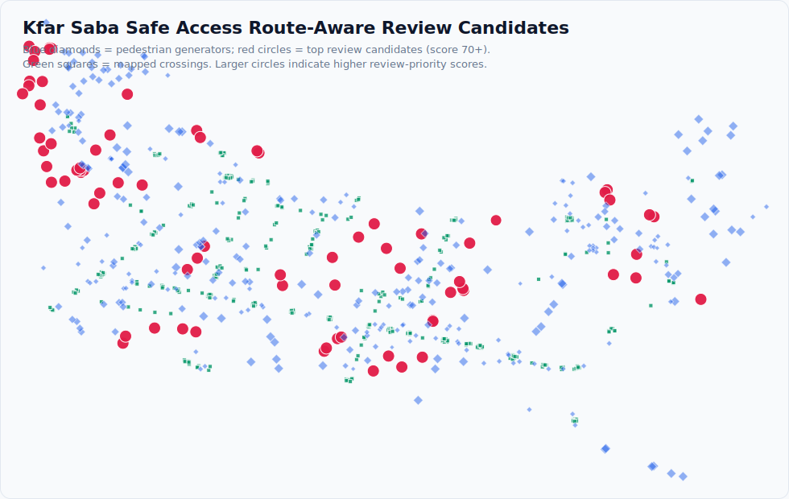

# GeoReview Studio — Kfar Saba pilot case study

A local-first GIS workbench that turns a raw OpenStreetMap extract into a ranked, explainable shortlist of pedestrian destinations to inspect on-site first. This case study covers the committed Safe Access Kfar Saba pilot run.

## Method

1. **Source.** OpenStreetMap / Geofabrik extract for Kfar Saba, Israel. Simplified geometry is enriched with raw OSM PBF tags; the analysis is projected to **EPSG:2039** (Israeli grid). The pilot boundary comes from OSM, not an official municipal boundary.
2. **Subject vs yardstick.** The subject is pedestrian **destinations** — schools, kindergartens, childcare, parks, playgrounds, bus stops, community centres. The yardstick is the nearest **mapped pedestrian crossing**, measured two ways: straight-line **and** along an OSM road-network proxy graph (9 828 nodes / 11 366 edges), plus a route-vs-straight **detour ratio**. It is a *mapped* crossing, not a "signalised" one — only 155 of the 342 crossings (45 %) carry a `traffic_signals` tag.
3. **Scoring.** A transparent rule set ([`../config/scoring_rules_v001.json`](../config/scoring_rules_v001.json)) converts mapped indicators (major road within 150 m = 25, no mapped crossing within 150 m = 25, route over 250 m = 20, high detour = 10, …) into a review-priority score. Missing OSM tags stay in a separate `data_quality_flags` column and add **zero** points.
4. **Output.** Destinations are ranked worst-first into a review queue; each candidate carries the approved review wording, reviewer decisions (status / note / assignee) persist in a local **SQLite** store, and the shortlist exports as a **CSV / GeoJSON** field worklist.

## Findings (committed pilot run)

| Metric | Value |
|---|---:|
| Pedestrian destinations analysed | 391 |
| Mapped crossings (155 tagged `traffic_signals`, 45 %) | 342 |
| Road segments | 2 603 |
| Median route distance to nearest mapped crossing | 218.6 m |
| p90 route distance | 627.2 m |
| Destinations over 250 m by route | 169 (43 %) |
| Destinations over 150 m by route | 244 (62 %) |
| Median detour ratio (route ÷ straight) | 1.26 |
| Route-reachable destinations | 390 of 391 |
| Priority-score range | 25 – 110 |

## Top 20 review candidates

Ranked by route-aware priority score (full data in [`sample_review_candidates_top20.csv`](sample_review_candidates_top20.csv)). Distances are to the nearest mapped crossing; "detour" is route ÷ straight-line.

| # | Type | Name | Straight (m) | Route (m) | Detour × | Score |
|--:|---|---|--:|--:|--:|--:|
| 1 | school | רחל המשוררת | 170.8 | 430.6 | 2.26 | 110 |
| 2 | park | — | 226.7 | 472.5 | 2.08 | 105 |
| 3 | school | חטיבת שרת | 339.7 | 477.0 | 1.37 | 100 |
| 4 | school | חטיבת הביניים ע"ש יורם טהרלב | 254.5 | 409.2 | 1.50 | 100 |
| 5 | school | חטיבת שז"ר | 270.6 | 334.0 | 1.19 | 100 |
| 6 | school | — | 221.0 | 273.4 | 1.20 | 100 |
| 7 | kindergarten | — | 668.6 | 1028.6 | 1.54 | 95 |
| 8 | bus_stop | דמרי סנטר/ספיר | 720.3 | 984.6 | 1.37 | 95 |
| 9 | bus_stop | דמרי סנטר/שלמה וחיה אנגל | 660.0 | 861.8 | 1.31 | 95 |
| 10 | kindergarten | גן אפיק, יובל, מעיין, נחל | 660.4 | 812.0 | 1.23 | 95 |
| 11 | school | בית ספר לאה גולדברג | 583.4 | 797.6 | 1.37 | 95 |
| 12 | kindergarten | גן מעיין | 656.1 | 790.1 | 1.20 | 95 |
| 13 | park | — | 503.6 | 717.4 | 1.26 | 95 |
| 14 | bus_stop | משה וילנסקי/ג׳ו עמר | 475.3 | 641.1 | 1.30 | 95 |
| 15 | playground | — | 452.4 | 632.4 | 1.40 | 95 |
| 16 | kindergarten | — | 422.1 | 550.0 | 1.30 | 95 |
| 17 | playground | — | 366.9 | 543.1 | 1.11 | 95 |
| 18 | playground | — | 347.2 | 520.0 | 1.06 | 95 |
| 19 | park | — | 374.9 | 519.8 | 1.39 | 95 |
| 20 | bus_stop | נעמי שמר/יאיר רוזנבלום | 370.6 | 507.9 | 1.34 | 95 |

> **How the review queue is built.** Every one of the 391 destinations is a review candidate — each scored at least 25 (one mapped indicator), so none are dropped as "clean". The dashboard ranks all 391 worst-first by priority score and, by default, shows the top **150** (frontend `limit=150`, minimum-score slider at 0). Raising the slider or ticking the *no mapped crossing within 150 m* / *major road within 150 m* filters narrows the list on demand, and the CSV / GeoJSON worklist export carries the full ranking (`limit` up to 500). Counts verified against the live `/api/dashboard-workspaces/{id}/candidates` endpoint on the committed pilot run.

## Correct interpretation

> This location has infrastructure risk indicators and should be reviewed on-site.

Missing OSM tags are data-quality gaps, not proof that infrastructure is absent.

## Limits

- **Uncalibrated.** The score is a transparent heuristic, never checked against crash or outcome data — it says *where to look first*, not *where it is worst*.
- **Proxy distance.** The road-network distance is an OSM road-graph proxy, not verified pedestrian routing; simplified geometry can over- or under-estimate real walking distance.
- **Region-shaped.** EPSG:2039 and the distance thresholds are Israel/OSM-specific; another region needs reprojection and recalibration, not just new data.
- **Boundary.** The pilot boundary is OSM/Geofabrik-derived, not an official municipal boundary.
- **Not fully bundled.** The multi-GB analysis artifact store behind these numbers lives outside the repository. A clone ships a ~2 MB demo subset — this pilot workspace — so the app runs on real Kfar Saba data out of the box; the full store is not committed.
